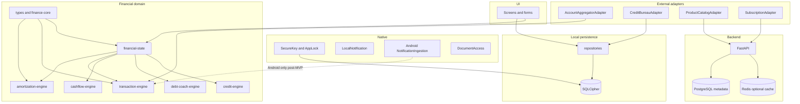
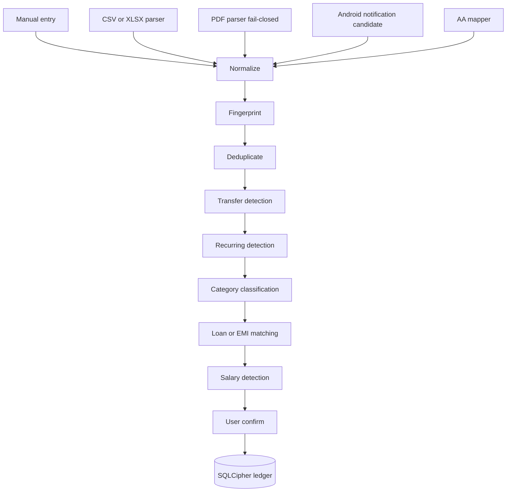
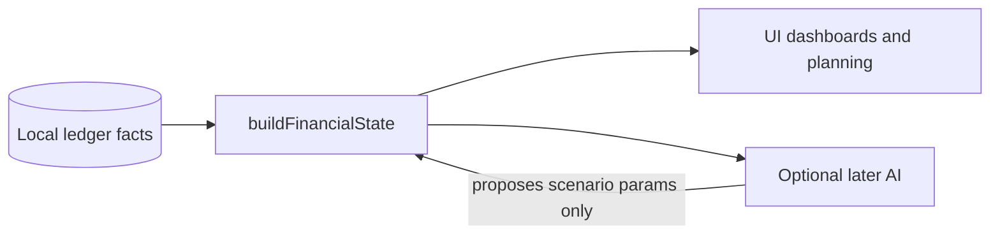
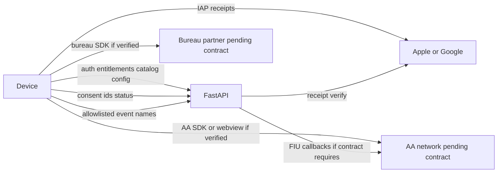
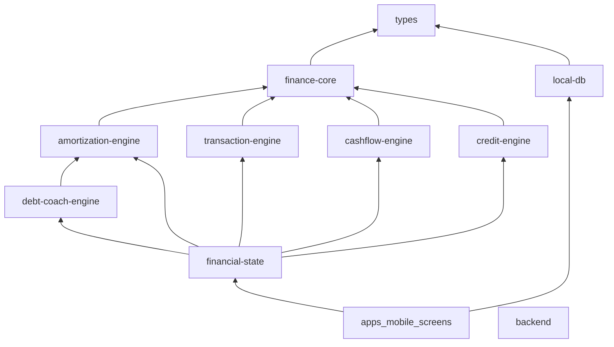

# EMI Coach system architecture

Copied from the approved architecture plan during Phase 1 bootstrap.

# EMI Coach System Architecture and Implementation Plan

> **Gate:** Do not write production application code until this document is approved. This plan maps the entire system, then sequences implementation. The first coding phase is monorepo bootstrap, not feature screens.

**Goal:** A privacy-first Indian personal-finance mobile app that tracks debt and cash flow locally, with a minimal backend for catalog, entitlements, and consented integrations.

**Architecture:** Device-owned encrypted SQLite ledger plus pure TypeScript financial engines; React Native UI; Kotlin/Swift Turbo Modules for platform work; FastAPI for non-ledger metadata only.

**Tech stack (pin at bootstrap, do not freeze invented patch versions):** React Native 0.87 CLI (New Architecture), TypeScript strict, Yarn 4 workspaces, `@op-engineering/op-sqlite` with SQLCipher (verify RN 0.87), FastAPI + Pydantic v2 + SQLAlchemy 2 + Alembic, PostgreSQL, Redis only for rate-limit/session/catalog cache in production.

## Global constraints

- Financial application: correctness, privacy, auditability, and deterministic calculations outrank implementation speed.
- React Native + TypeScript for shared UI and domain orchestration.
- Isolate Android/iOS-specific behavior behind native modules or adapters.
- Keep detailed personal financial records local on the device by default.
- Do not introduce a backend transaction-ledger endpoint unless this architecture document is explicitly revised.
- Never collect or persist bank passwords, UPI PINs, debit/ATM PINs, CVV, or net-banking credentials.
- Financial calculations must be deterministic TypeScript (mobile engines). Do not use an LLM to calculate money. Do not reimplement EMI math on the backend.
- External financial providers must sit behind adapter interfaces with mock implementations.
- Every persisted field must identify source, sensitivity, retention, local/server boundary, and deletion behavior.
- Never log sensitive financial payloads.
- Use migrations for all persistent-schema changes.
- Transfers and debt repayments must not be counted as spending twice.
- Do not invent provider APIs, credentials, SDK methods, regulatory approvals, or undocumented library capabilities.
- iOS must remain fully useful without Android-only capabilities.

---

## 1. Current repository state

The workspace is **greenfield production intent with no application code**.

Present:

- [`.cursor/rules/00-project-principles.mdc`](.cursor/rules/00-project-principles.mdc)

Absent: React Native app, native modules, FastAPI, PostgreSQL schema, packages, tests, CI, `graphify-out/`.

Parent-folder product notes exist outside this repo and are treated as intent, not as shipping code.

---

## 2. System architecture

Ten layers. Dependencies point inward. UI never calls engines or persistence-derived math directly.

```text
1. Persisted financial facts (SQLCipher ledger writes)
2. Deterministic TypeScript engines (pure; no RN/network/backend/LLM)
3. Financial Truth / FinancialState (the only read model for dashboards and planning)
4. UI (screens bind to FinancialState; no formulas)
5. Native platform integrations (Turbo Modules)
6. External financial integrations (null/mock adapters by default)
7. Backend services (FastAPI metadata; never a ledger)
8. Authentication (optional account; never bank login)
9. Subscription/billing (null adapter by default)
10. Analytics/telemetry (event names only; no amounts)
```

**Write source of truth:** SQLCipher persisted facts (accounts, loans, payments, transactions with `kind`, confirmed recurring/income).
**Read source of truth:** `buildFinancialState(ledgerSnapshot)` in `packages/financial-state`.
Screens, widgets, notifications copy, and (later) AI receive FinancialState or scenario results. They do not import engine packages.



**Runtime modes**

- **Offline MVP:** layers 1–5 only. Adapters return `Unsupported` / mock empty. Backend optional.
- **Connected:** catalog, auth, entitlements, later AA/CIBIL through adapters.
- **Degraded:** AA/CIBIL/catalog/billing failures never block loan math, reminders, or the local ledger.

---

## 3. Repository structure

Yarn 4, `node-modules` linker. Bare React Native CLI app (not Expo managed). Official init:

`npx @react-native-community/cli@latest init EmiCoach --directory apps/mobile --skip-git-init --skip-install`

Then hoist into workspaces. Metro `watchFolders` = repo root. SQLCipher config lives on the **root** `package.json` (`op-sqlite.sqlcipher: true`) per op-sqlite monorepo docs.

```text
emi-coach/
  apps/mobile/
    android/
    ios/
    src/
      app/
      navigation/
      screens/
      features/          # orchestration only
      components/
      hooks/
      assets/
  packages/
    types/
    finance-core/
    amortization-engine/
    transaction-engine/
    cashflow-engine/
    debt-coach-engine/
    credit-engine/
    financial-state/         # ONLY read model for dashboards and planning
    provider-contracts/  # interfaces + null/mock adapters; no vendor SDK imports here
    local-db/
    secure-storage/
    notifications/
    analytics/           # allowlisted event schema
    contracts/           # OpenAPI for backend<->app metadata only
    ui/
  native/
    android/             # Kotlin TurboModules
    ios/                 # Swift TurboModules
  backend/
    app/
      api/v1/
      core/              # settings, logging redaction, forbidden-field guards
      models/
      services/
      providers/
    alembic/
    tests/
    pyproject.toml
  docs/
    architecture/
    security/
    privacy/
    integrations/        # PENDING_VERIFICATION.md
    product/
  .cursor/rules/
  .github/workflows/
  README.md
  SECURITY.md
```

**Package dependency rules**

- `types`: no React, no I/O, no network.
- engines (`amortization-engine`, `transaction-engine`, `cashflow-engine`, `debt-coach-engine`, `credit-engine`, `finance-core`): `types` + `finance-core` only. Forbidden imports: `react`, `react-native`, `fetch`, any backend client, any LLM SDK.
- `financial-state`: engines + `types` only. Takes a `LedgerSnapshot` (plain data). No React, no network.
- `local-db`: schema/repos; returns facts / `LedgerSnapshot`. **Must not** call engines or persist dashboard numbers as a second truth.
- `provider-contracts`: interfaces + `Null*` / `Mock*` adapters; vendor SDKs only after contract verification.
- `apps/mobile/src/screens/**` and `components/**`: may import `financial-state`, `local-db` (writes), `ui`, navigation. **Must not** import engine packages. Enforced by dependency-cruiser / ESLint boundaries in CI.
- `backend`: `packages/contracts` OpenAPI only. Must not import engines, `financial-state`, or `local-db`. Must not calculate EMI, interest, cashflow, or debt-free dates.

SQLite stores facts. `FinancialState` is the only derived dashboard/planning truth. Zustand is ephemeral UI. TanStack Query is remote config/catalog/subscription only.

---

## 4. Domain model

**Conventions**

- IDs: ULID strings.
- Money: `MoneyMinor` branded safe integer, **paise**, currency `INR` for v1. Example: ₹19,184.50 → `1918450`. Reject non-integers and values outside `Number.MAX_SAFE_INTEGER`.
- No IEEE floats in persisted or calculated money.
- Timestamps: UTC ISO-8601; display in device timezone.
- Every record: `id`, `createdAt`, `updatedAt`, `source`, `sensitivity`.
- `source`: `manual` | `csv_import` | `xlsx_import` | `pdf_import` | `android_notification` | `account_aggregator` | `credit_bureau` | `derived_engine` | `system`.
- `sensitivity`: `public` | `low` | `high` | `very_high` | `secret_never_store`.
- `localServerBoundary`: `device_only` | `backend_allowed` | `never_store`.
- Engines clone inputs for scenarios; they never mutate persisted loans.

### 4.1 UserProfile (device)

- `displayName`, `currency`, `locale`, `timezone`, `financialMonthStartDay`, lock settings flags.
- Sensitivity: low–high. Boundary: device_only. Deletion: local wipe.

### 4.2 FinancialInstitution / FinancialAccount

- Institution: name, type (`bank` | `nbfc` | `card_issuer` | `other`), optional provider id.
- Account: `institutionId`, `accountType` (`savings` | `current` | `credit_card` | `loan` | `wallet` | `other`), **masked** account number only, `currency`, optional `currentBalanceMinor`, `balanceAsOf`, `syncMetadata`.
- Never store full account number, IFSC+account combo beyond mask, or login secrets.
- Sensitivity: very_high. Boundary: device_only.

### 4.3 Loan

- `loanType`: home | car | personal | education | gold | consumer | bnpl | other.
- `originalPrincipalMinor`, `outstandingPrincipalMinor`, `annualRateBps` (basis points integer), `interestRateType`, `tenureMonths`, `remainingTenureMonths`, `emiMinor`, `dueDay`, dates, fee/prepay/foreclosure terms as user-entered structured fields, `status`.
- Sensitivity: very_high. Boundary: device_only.

### 4.4 LoanPayment / LoanRateChange

- Due/paid dates, `amountMinor`, `principalComponentMinor`, `interestComponentMinor`, `feeComponentMinor`, `sourceTransactionId`, `status`.
- Rate changes are dated events; past paid rows are immutable when future assumptions change.

### 4.5 CreditCard / CreditCardStatement / CreditCardEmi

- Masked number only. Never PAN, CVV, PIN, expiry if not required; prefer last-4 only.
- Statement: statementDate, dueDate, totalDue, minDue, interest, fees, paymentStatus.
- Card EMI conversion scenarios are **engine outputs**, persisted only if the user saves a scenario.

### 4.6 Transaction (ledger)

- `accountId`, `source`, `sourceReference`, `transactionDateTime`, `postingDate`, `amountMinor`, `direction` (`debit` | `credit`), `merchantRaw`, `merchantNormalized`, `category`, `subcategory`, `transactionMode`, `transferGroupId`, `kind`, `confidence`, `userOverride`, `fingerprint`.
- **`kind` (accounting, required):** `expense` | `income` | `internal_transfer` | `debt_drawdown` | `debt_repayment` | `interest` | `fee` | `refund` | `reversal` | `cash_withdrawal`.
- Credit-card purchase → `expense`. Later bank payment of that card → `debt_repayment` or `internal_transfer`, never a second expense.

### 4.7 RecurringPayment / IncomeEvent

- Recurring: merchant, amount range, frequency, nextExpectedDate, confidence, linked ids, type (`rent` | `subscription` | `insurance` | `utility` | `emi` | `sip` | `tuition` | `transfer` | `other`). Do not label EMI without sufficient evidence.
- Income: amount, typical date window, variance, `incomeType` (`salary` | `other`), user confirm/reject. Detection never auto-rewrites transactions.

### 4.8 CashflowSnapshot / DebtScenario / DebtGoal

- Engine outputs with stored **assumptions** so they are reproducible. Boundary: device_only.

### 4.9 CreditProfile (local cache of bureau facts)

- Score, scoreDate, source, lastUpdated, utilization summary, counts if provided by a **verified** bureau adapter.
- Store minimum necessary. Report **body** stays device_only. EMI Coach analysis is a separate labeled object, never mixed into bureau facts.

### 4.10 ConsentMetadata

- provider, consent reference, created/expiry, frequency, dataRange, dataTypes, status.
- Device holds the user-visible copy. Backend may hold the **minimum FIU session fields** a verified AA contract requires (ids, signatures, status), never the FI payload as a ledger.

### 4.11 ProviderOffer (catalog cache)

- Copied from backend published catalog. Fields: indicative rate range, fees, tenure, source, effectiveDate, lastVerifiedAt, `offerCertainty`: `indicative` | `provider_confirmed`.
- UI must not say “guaranteed” unless `provider_confirmed`.

### 4.12 DocumentMetadata

- Local file in encrypted attachments dir. Hash, mime, source. No cloud upload in MVP.

### 4.13 SecretNeverStore

- Bank password, net-banking password, UPI PIN, debit PIN, ATM PIN, CVV, card PIN: **no column, no log, no API field, no backup field**. Schema linter must fail CI if these names appear.

---

## 5. Database schema

### 5.1 Local SQLCipher (device)

All money columns `INTEGER` paise. Schema versioned via `schema_migrations`.

- `user_profile` — singleton profile + security flags (not the PIN, not the DEK).
- `institutions`
- `accounts`
- `loans`
- `loan_payments`
- `loan_rate_changes`
- `credit_cards`
- `credit_card_statements`
- `credit_card_emi_plans` — user-saved card EMI plans, not live PAN data
- `transactions` — includes `kind`, `fingerprint` UNIQUE per account+fingerprint
- `recurring_payments`
- `income_events`
- `cashflow_snapshots`
- `debt_scenarios`
- `debt_goals`
- `credit_profiles`
- `consent_records`
- `provider_offer_cache` — published catalog rows + `fetched_at`
- `documents`
- `notification_schedules` — local reminder ids, **no amount column by default**
- `entitlement_cache` — plan id, expiry, source store, `verified_at`
- `audit_local` — action type + entity id only, no payloads

Indexes: `transactions(account_id, posting_date)`, `transactions(fingerprint)`, `loan_payments(loan_id, due_date)`, `notification_schedules(fire_at)`.

Attachments: files on disk under app sandbox, encrypted with a key wrapped the same way as the DB DEK (or SQLCipher + optional file encryption via platform APIs). Unencrypted statement copies are deleted after import commit.

### 5.2 PostgreSQL (server metadata only)

**Allowed tables**

- `app_users` — opaque user id, created_at, deletion_requested_at. No loan/balance columns.
- `devices` — device public id, platform, app version. No hardware identifiers beyond what stores already send if required later.
- `sessions` — hashed refresh tokens, expiry.
- `app_config` — feature flags, min app version.
- `providers` / `loan_products` / `product_rates` — **public catalog**, indicative, with source + last_verified_at.
- `subscriptions` — store, original_transaction_id / purchase token (store identifiers), product_id, status, expiry, grace. No ledger.
- `consent_sessions` — provider, consent_id, status, expiry, created_at. **No FI JSON, no transactions.**
- `credit_auth_sessions` — partner session id, status, expiry. **No score, no report body.**
- `admin_users` — catalog publishers, separate from consumers.
- `audit_log` — actor, action, resource type, resource id, ip hash. Redacted.

**Forbidden tables / columns (CI guard)**

- transactions, merchants, salary, loan_balance, statement_pdf, cibil_report, pan, cvv, upi_pin, bank_password, full_account_number.

### 5.3 Redis (production only, optional for local MVP)

Genuinely justified uses:

- Rate-limit counters.
- Short-lived session cache if not solely DB-backed.
- Published catalog cache.

Never: ledger, FI payloads, CIBIL reports, backup blobs as plaintext.

MVP and local dev: FastAPI can run **without Redis**. Production enables Redis for abuse protection.

---

## 6. Data-flow diagrams

### 6.1 Ledger ingest (all sources converge)



iOS has no `Notif` node. Core product does not depend on it.

### 6.2 Calculation vs coaching



AI (post-MVP) receives FinancialState summaries only. It cannot add numbers that did not come from engines inside `financial-state`.

### 6.3 What may leave the device



No arrow carries raw transaction history, balances, salary, loan statements, card history, or CIBIL report contents **unless a later, named integration contract requires a specific field**. That exception must update `docs/architecture/data-boundaries.md` before any endpoint is added.

---

## 7. Security architecture

**Threats and controls**

- Stolen phone: app PIN, biometric gate, SQLCipher, auto-lock, privacy screen.
- DB file extraction: DEK not in the DB file; OS-backed wrapping.
- Backend compromise: no ledger on server.
- Logs: structured redaction; deny-list of field names.
- Clipboard: do not copy full account numbers; short-lived copy if needed.
- Fake offers: catalog `indicative` vs `provider_confirmed` + last_verified_at.
- Miscalculation: golden tests, property tests, no LLM math.
- Third-party SDK: adapter isolation, permission minimization, version pin.

**Key hierarchy (no homegrown AES implementation in JS)**

1. App PIN verifier: salt + KDF (Argon2id or platform equivalent) stored in Keychain/Keystore. Raw PIN never stored.
2. Database DEK: 256-bit random, generated on device.
3. iOS: DEK wrapped with a Keychain item. Prefer a Secure Enclave–resident wrapping key (`kSecAttrTokenIDSecureEnclave` + EC key) **in the Swift `SecureKeyModule`**. Do not claim `react-native-keychain` always uses Secure Enclave; the first-party Swift module owns SE attributes. If SE is unavailable, Keychain still wraps the DEK; app continues with that documented downgrade.
4. Android: DEK wrapped with Android Keystore AES/GCM key (`setUserAuthenticationRequired` where used). Weak (Class 2) biometrics must not be the only unlock path; app PIN / device credential fallback is required.
5. Unlock: verify PIN hash (PIN is **never** the SQLCipher key, never concatenated into the key, never used as KDF input for the DEK). Then optional biometric. Then unwrap the **random DEK** from Keychain/Keystore. Then pass DEK to SQLCipher open. DEK must not appear in JS logs, Zustand, analytics, or crash reports.

**App lock**

- First-run: create PIN, optional biometrics.
- Background/inactivity lock.
- Failed-attempt backoff; destructive reset only after explicit confirm (wipes DB + keys).
- Notifications on lock screen: no amounts unless user opt-in.

**Transport**

- TLS 1.2+; prefer 1.3. Certificate pinning is a later hardening decision (requires ops process). Pinning is not claimed as shipped in MVP.

**Do not implement custom crypto libraries.** Use SQLCipher, Keychain, Keystore, Secure Enclave APIs, and OS TLS.

---

## 8. Privacy architecture (DPDP-oriented, not a legal opinion)

**Roles (product assumption, needs legal confirmation)**

- EMI Coach app: processes personal financial data primarily **on device**.
- Backend: processes account, device, subscription, catalog, and (if ever) consent-session metadata.
- AA / bureau / stores: independent controllers or processors under **their** contracts once selected.

**Purpose limitation**

- Ledger: provide the user with debt/cash-flow tools on device.
- Backend identity: entitlements, catalog, support, consented integrations.
- Analytics: product quality, no profiling on raw finance.

**Consent**

- App lock and local processing: necessary for the service; explain in plain language.
- AA, bureau, notification listener, cloud backup, analytics: **purpose-specific opt-in**, revocable.
- Consent history stored locally; AA consent also reflected from provider status when integrated.

**User rights (in-app Privacy Centre)**

- Access/export of **user-owned local data** in a documented JSON/CSV format.
- Delete local DB + keys + attachments.
- Revoke AA/bureau consents when adapters exist.
- Show honestly what third parties may retain (unknown until contracts exist).

**Copy rule**

- Allowed: “Records are stored and processed on your device. We minimize server-side financial data. We do not ask for bank passwords, UPI PIN, card PIN, or CVV.”
- Forbidden: “Your financial data never leaves your phone” (false once AA, billing, or backup exist).

**Analytics allowlist**

- `app_opened`, `loan_created`, `loan_calculation_completed`, `scenario_created`, `statement_import_started`, `statement_import_completed`, `reminder_created`, `premium_viewed`, `subscription_started`.
- Forbidden: amounts, merchants, scores, account identifiers, raw errors containing statement text.

**Data inventory** will live at `docs/privacy/data-inventory.md` (machine-readable YAML or JSON plus human summary). Every new field updates it in the same PR.

---

## 9. API contract (backend)

Base: `https://api.<env>/v1`. Auth: optional bearer session for account features. MVP app functions **without** calling the API.

**Public / app**

- `GET /health` / `GET /ready`
- `GET /v1/config` — flags, min version
- `POST /v1/auth/session` — create anonymous or signed-in session (provider TBD: Sign in with Apple/Google; **pending product decision**)
- `DELETE /v1/auth/session`
- `GET /v1/providers`
- `GET /v1/loan-products`
- `GET /v1/rates` — indicative catalog only
- `POST /v1/subscriptions/verify` — store receipt/token; returns entitlement; **no financial ledger fields**
- `POST /v1/subscriptions/restore`
- `POST /v1/account/delete` — deletes server metadata; client still wipes local DB
- `GET /v1/consents/:id` — status of consent **session metadata** if AA is live
- `POST /v1/consents/:id/revoke` — instructs adapter/provider; does not fetch FI

**Admin (separate auth)**

- CRUD for catalog publish; never reads device ledgers (there are none).

**AA FIU callbacks (only after ReBIT + partner contract is in `docs/integrations/`)**

- Placeholder **names only**, not invented paths: consent-notification and FI-notification as specified by the verified ReBIT/partner document.
- Handler rules: authenticate partner, store session status, **do not persist FI as a user ledger**. If the contract forces a transient FI payload on the server, write a deletion TTL of hours, never days, and a follow-up architecture amendment. Until then, **these routes are not implemented**.

**Explicitly does not exist**

- `POST /v1/transactions`
- `GET /v1/loans`
- `POST /v1/statements`
- `GET /v1/cibil/report`
- Any webhook that stores salary or merchants.

Pydantic models include a CI test: fail if property names match a forbidden list.

OpenAPI is generated into `packages/contracts` for the mobile client.

---

## 10. Native-module boundaries

Turbo Native Modules (RN New Architecture / Codegen). JS facades in `packages/secure-storage` and `packages/notifications`.

**Both platforms**

- `SecureKeyModule` — generate DEK, wrap/unwrap, wipe. iOS implements SE wrapping when hardware allows.
- `AppLockModule` — PIN hash verify, biometric prompt, attempt counter. Does not store PIN.
- `PrivacyScreenModule` — FLAG_SECURE / iOS screenshot hide, blur on background.
- `LocalNotificationModule` — schedule/cancel; body template without rupees unless flag set.
- `DocumentAccessModule` — pick and read file bytes into sandbox.
- `BillingModule` (post-MVP) — StoreKit 2 on iOS, Play Billing on Android, same JS `SubscriptionAdapter`.

**Android only — post-MVP, default adapter is null**

- `NotificationIngestionModule` is not part of MVP. When built later, it uses `NotificationListenerService`, a user allowlist, candidate parsing, immediate drop of unrelated notifications, and no full notification archive. Feature flag `androidNotificationIngestion` defaults off. **No SMS permission.**
- MVP and iOS always use `NullNotificationIngestionAdapter`.

**iOS must compile without Android ingestion modules.** iOS UX is manual entry, statement import, and future AA.

**Later, after vendor docs exist**

- `AaClientModule` — wrap official AA SDK or official webview redirect only.
- Optional `DeviceIntegrityModule` — Play Integrity / App Attest after a threat review.

---

## 11. Account Aggregator boundary

**Not selected. Not implemented as a real SDK. No invented endpoints.**

```ts
interface AccountAggregatorAdapter {
  initialize(config: AAConfig): Promise<void>;
  discoverAccounts(): Promise<DiscoveredAccount[]>;
  createConsent(request: ConsentRequest): Promise<ConsentSession>;
  fetchFinancialInformation(consentId: string, range: DataRange): Promise<RawFinancialData>;
  revokeConsent(consentId: string): Promise<void>;
  getConsentStatus(consentId: string): Promise<ConsentStatus>;
}
```

- `MockAccountAggregatorAdapter` returns synthetic accounts and empty/error states for tests.
- Mapping: `RawFinancialData` → normalized transactions/accounts → **same ingest pipeline** as CSV (user confirm).
- App runs fully if adapter throws `NotConfigured`.
- Production wiring requires: FIU registration or FIU partner, named AA, official SDK/API docs copied into `docs/integrations/aa/`, security review of SDK process isolation (Sahamati SDK guidance exists for Android; iOS path must be documented by the vendor).
- ReBIT FIU callback APIs are server-side; they are **not** a license to host the user’s ledger.

Data hierarchy: AA (when authorized) → statement import → optional Android notifications → manual.

---

## 12. CIBIL / credit-bureau boundary

**Not selected. Do not scrape cibil.com. Do not collect CIBIL passwords.**

```ts
interface CreditBureauAdapter {
  startAuthorization(): Promise<CreditAuthorizationSession>;
  getReport(): Promise<CreditReportResult>;
  getScoreHistory(): Promise<CreditScorePoint[]>;
}
```

- Mock returns `Unavailable`.
- UI distinguishes **Bureau facts** vs **EMI Coach analysis**.
- Local cache: score + date + source + lastUpdated. Report PDF/JSON body: device_only, minimum retention, user-deletable.
- Backend `credit_auth_sessions` stores partner session ids only.
- Production requires an official partner listed by CIBIL (or successor authorized channel) and that partner’s contract in-repo.

---

## 13. Subscription architecture

Plans (product defaults, prices **not** locked): `free`, `plus_monthly`, `plus_annual`, optional `early_access_lifetime`.

**Free (MVP-aligned):** limited loans/accounts, basic EMI, reminders, manual txn, basic cashflow/debt plan.

**Plus candidates:** unlimited, import automation, advanced cashflow, prepay optimizer, BT comparison, encrypted backup, AA when live.

```ts
interface SubscriptionAdapter {
  getEntitlements(): Promise<EntitlementSnapshot>;
  purchase(planId: string): Promise<PurchaseResult>;
  restore(): Promise<EntitlementSnapshot>;
}
```

- iOS: StoreKit 2 via `BillingModule`.
- Android: Play Billing via `BillingModule`.
- Backend verifies with Apple/Google **official** verify APIs (document current URLs at implementation time; do not invent).
- Local `entitlement_cache` allows offline use until expiry + grace.
- If verify is delayed: last good cache, conservative feature gate, no ledger upload.
- Do not use RevenueCat unless a later privacy review accepts their processor role.
- No ads on financial dashboards.

---

## 14. Offline-first synchronization model

There is **no ledger sync**. Calling this “sync” only applies to **non-financial metadata**.

- Ledger, loans, transactions, documents: never synced. Device is source of truth.
- Catalog: pull on launch or interval; show `lastVerifiedAt`; stale banner; app works on last cache.
- Config flags: pull; fail open for core debt features.
- Entitlements: pull after purchase or restore; cache; grace if offline.
- Consent status: pull when AA is configured; if the network is down, show the local copy with “status may be outdated”.
- Analytics: queue allowlisted events; drop the event if a forbidden key is present.

**Conflicts:** not applicable to ledger. For entitlements, **store/server verification wins** when online. For catalog, **newer published version wins**. Never merge two devices’ ledgers in v1 (no family sharing).

**Idempotency:** statement import fingerprints; subscription verify is idempotent on store transaction id.

---

## 15. Backup and recovery model

**MVP:** no cloud backup. User is warned that uninstall **destroys** local data unless they export.

**Post-MVP optional encrypted backup**

```text
SQLCipher export / structured dump
  → encrypt with backup DEK
  → backup DEK wrapped by user recovery passphrase (KDF in native module)
  → .emicbackup blob
  → user-chosen destination (Files / Drive / iCloud) 
```

- Cloud providers receive ciphertext only.
- Recovery passphrase is not stored on the backend.
- Restore: only onto empty store or explicit replace. No silent merge.
- Backup format versioned; includes schema version; never includes PIN or unwrapped DEK.
- Device-to-device: same blob; not a multi-device live sync product in v1.

---

## 16. Testing strategy

- **Vitest** in TS packages. **pytest** in backend. RN Testing Library for UI. Native unit tests for lock/key modules where practical.
- Engine unit tests: EMI, rounding, prepay, tenure vs EMI reduction, rate change, card EMI tenures, BT break-even (including cheaper rate / worse total cost).
- Property tests: schedule principal identity under stated rounding policy; prepay never increases principal; duplicate import stable count; transfers do not inflate spending; repayment of card bill does not double-count.
- Golden fixtures: synthetic INR cases (simple, high-rate, fee, overlapping dues, salary delay, duplicate CSV, card + bank payment, missed payment, partial payment).
- Import tests: debit/credit sign conventions, date formats, skipped rows visible, never silent drop.
- Adapter tests: timeout, expired consent, duplicate/partial FI, bureau down.
- Persistence: migration up; open without DEK fails; delete wipes files + keys.
- Backend: forbidden-field CI; catalog publish; receipt verify with **recorded fixtures** (no live store calls in CI).
- Notification: default copy has no rupee amount.
- Definition of done: domain + repo + validation + empty/error/offline + privacy note + tests. A pixel-perfect screen is not done.

Rounding policy is specified in **section 26.13**. Copy to `docs/architecture/rounding.md` at bootstrap. Amortization implementation is forbidden until tests encode that spec.

---

## 17. CI/CD strategy

GitHub Actions:

- `ci-packages`: lint, typecheck, Vitest
- `ci-backend`: ruff/mypy/pytest
- `ci-android`: assemble debug
- `ci-ios`: build on macOS runners when available (do not block Android-only contributors forever; document as required before store release)
- `ci-privacy`: grep/schema guard for forbidden field names in backend models and analytics events

No secrets in the repo. Env templates only. Production deploy (later): containerized FastAPI, managed PostgreSQL, Redis, secrets manager, migrations in release job, health/ready probes. No “sync ledger” job will ever exist.

---

## 18. Development phases

0. Architecture gate (this document) + Cursor rules (exists).
1. Monorepo bootstrap (RN 0.87 + FastAPI hello + CI + dependency-cruiser).
1b. **HARD GATE — op-sqlite + SQLCipher compatibility** (see section 26). No domain/UI work until this gate PASSes or a documented SQLCipher fallback is chosen.
2. Secure local DB + random DEK wrapping + app lock + redacted logging.
3. Domain types + local schema + classification fields + `financial-state` skeleton.
4. Amortization engine implementing the rounding spec + golden tests + loan repository.
5. Credit-card engine + double-count tests.
6. Transaction ledger + classification (rule-based).
7. Recurring + salary detection (confirm/reject).
8. Cashflow + debt-escape + prepay + BT engines, all exposed only via `financial-state`.
9. MVP screens: Home, Money, Debt, Plan, Settings — **read FinancialState only**.
10. Local notifications (no amounts).
11. CSV/XLSX import; PDF plugins later.
12. **Post-MVP:** Android notification ingestion behind flag + adapter.
13. Catalog backend + BT UX (indicative).
14. Subscriptions.
15. Privacy Centre, export, delete.
16. Encrypted backup.
17. AA adapter (null/mock → vendor after contract).
18. CIBIL adapter (null/mock → vendor after contract).
19. Optional AI explanation boundary (FinancialState summaries only).
20. Security/privacy/offline/a11y audits, store, production infra.

---

## 19. MVP scope

**In**

- Secure onboarding, PIN + biometric lock
- Manual accounts, loans, credit cards
- Amortization, EMI schedule, mark payment
- Prepayment scenario (does not mutate source loan)
- Manual transactions + basic categories
- CSV import with preview/dedupe
- Basic cashflow and Debt Escape scenarios
- Local reminders without amounts
- Privacy copy + local delete
- Fully usable **offline** on iOS and Android

**Out**

- Production AA
- Production CIBIL
- Loan origination / brokerage
- Bank scraping / SMS ingest
- Server-side ledger
- Cloud backup
- Paid IAP (can ship free-only)
- ML/LLM classification
- Family sharing, tax, investments, insurance management
- Android `NotificationListenerService` / notification ingestion (**hard exclusion from MVP**)

**First milestone:** encrypted offline app: add a loan, see schedule, mark EMI, run prepayment, see debt-free date — all numbers from `FinancialState`.

---

## 20. Post-MVP scope

- XLSX polish, PDF bank-format plugins (fail closed)
- Android notification assist
- Subscriptions
- Encrypted backup
- Provider catalog + BT comparison UX
- AA (after legal + SDK)
- Authorized bureau
- Credit dashboard with labeled analysis
- Reports / local PDF
- Optional AI coach on **derived** facts
- Device integrity, pinning, pentest
- Hindi/other locales (domain already locale-ready)

Not before retention: household sharing, refinance origination, investments.

---

## 21. Risks and mitigation

- **op-sqlite SQLCipher × RN 0.87 unproven at lock time:** bootstrap spike; fallback to another New Architecture SQLCipher binding; never JS-side AES-of-SQLite-file.
- **Secure Enclave vs Keychain-only:** Swift module tries SE; documented fallback.
- **Android Class 2 biometrics:** PIN fallback always.
- **AA/FIU legal:** mock until counsel + partnership.
- **CIBIL scrape temptation:** adapter + mock; no WebView login to cibil.com.
- **PDF quality:** small parser set; else ask CSV.
- **Play notification policy:** optional feature, disclosure, no SMS.
- **Double-count regressions:** fixture in CI named `card_purchase_then_payment_is_not_two_expenses`.
- **Stale catalog:** UI labels dates; no “you are approved”.
- **Uninstall data loss:** onboarding warning; backup later.
- **Monorepo native clashes:** forbid `expo-sqlite`; op-sqlite config at repo root.
- **Store financial-app review:** legal entity and partner docs before AA/CIBIL flags go true.

---

## 22. External dependencies

**Chosen direction (verify versions at bootstrap)**

- React Native 0.87, React Navigation, Zustand, Zod, RHF, TanStack Query
- `@op-engineering/op-sqlite` + SQLCipher flag
- FastAPI, Pydantic v2, SQLAlchemy 2, Alembic, PostgreSQL
- Papa Parse (CSV)
- SheetJS Community or ExcelJS for XLSX **after license confirmation**

**Explicitly not chosen yet (interface + mock)**

- Account Aggregator vendor / FIU partner
- CIBIL official partner
- Analytics vendor (can be self-hosted events)
- Cloud host (AWS intended later)
- IAP server libraries (use official store APIs)
- PDF engine / OCR

**Do not add**

- Bank-scrape SDKs
- SMS receivers
- RevenueCat unless reviewed
- Backend Celery unless a real job appears
- LLM inside engines

---

## 23. Decisions that require human / business / legal approval

These are **not** engineering defaults:

1. Legal entity, Grievance Officer / DPO, privacy policy, terms (DPDP).
2. Whether EMI Coach becomes an FIU or only partners with an FIU.
3. Which Account Aggregator to contract.
4. Which CIBIL (or other bureau) official partner to contract.
5. Whether comparison UX could be construed as digital lending / LSP (RBI) — **default: comparison only, no origination**.
6. Google Play justification for notification listener (if shipped).
7. Apple financial-app / sensitive-data review posture.
8. Pricing and IAP products.
9. Whether to offer cloud encrypted backup.
10. Sign-in providers (Apple/Google) vs anonymous device.
11. Analytics vendor vs none.
12. Certificate pinning ops ownership.
13. Age rating and whether minors can use the app.
14. Trademark “CIBIL” usage in UI (likely “credit report” until licensed).
15. Country expansion beyond India (currency/KYC/AA do not generalize).

---

## 24. Internal contradiction check

Reviewed before implementation:

1. **Local-first vs AA FIU server fetch:** If a future AA contract requires the FIU server to receive FI, that is an explicit exception: transient, not a ledger, documented, TTL, then device import. Until contract exists, **no such storage**. Not a contradiction if the exception process is mandatory.
2. **Local-first vs encrypted backup:** Backup is optional, user-keyed, ciphertext-only. Onboarding must not claim data cannot leave the device if backup is enabled.
3. **Local-first vs IAP:** Receipts are store identifiers, not transactions of the user’s bank. Allowed.
4. **iOS vs Android notifications:** Ingestion is Android-only; iOS has full MVP via manual/import/AA-later. No shared code path that requires `NotificationListenerService`.
5. **Secure Enclave wording:** Architecture requires a Swift path that **requests** SE wrapping, not a guarantee on every iPhone/library. Fallback is Keychain.
6. **Redis “in the stack” vs “only if required”:** Local/MVP runs without Redis. Production uses it for rate-limit/session/catalog cache only.
7. **Auth vs offline:** Core finance works with zero account. Auth is for catalog-admin, IAP restore convenience, and future integrations.
8. **Backend FastAPI present vs unused in MVP:** Skeleton exists so we do not later dump a ledger API in; routes that are not allowed are never added.
9. **Catalog rates vs “guaranteed offer”:** `offerCertainty` + UI copy. Engineering default is indicative.
10. **Card bill vs expense:** `kind` is mandatory; tests lock the semantics.
11. **LLM coach vs math:** Coach may only call engine functions; it cannot output rupees from the model.
12. **Duplicate engines in Python:** Forbidden. Python does not calculate EMI for users.
13. **Family/multi-device vs one DEK:** v1 is single-device. Sharing would need a new key-distribution design; out of scope.
14. **Analytics vs privacy:** allowlist + CI grep.
15. **Notification amounts:** default off; user flag documented as a privacy reduction.

No remaining contradiction requires inventing a vendor API. Residual uncertainty is recorded in `docs/integrations/PENDING_VERIFICATION.md` at bootstrap:

- op-sqlite × RN 0.87
- XLSX library license
- AA SDK + FIU callback exact paths
- Bureau partner API
- Store receipt-verify current endpoints
- Play/App Store current financial policies

---

## 25. Implementation rule after approval

When this plan is approved, implementation order is:

1. Phase 1 bootstrap (empty app + CI + copy docs).
2. Phase 1b **op-sqlite compatibility gate** — stop if FAIL.
3. Only then secure DB, `financial-state`, engines, MVP screens.

Do not implement feature screens or financial engines in the bootstrap slice.

---

## 26. Final architecture validation pass (2026-09-21)

This section is the **explicit** amendment record. Earlier drafts were incomplete on items 1, 2, 8 (soft MVP wording), 11–14, and 16. Those gaps are closed here, not silently.

### 26.0 Scorecard

- Req 1 Financial Truth layer: **was GAP** → amended (`packages/financial-state`).
- Req 2 single sources of truth: **was GAP** (screens could call engines) → amended.
- Req 3 UI must not calculate: **was weak** → amended + CI boundary.
- Req 4 no duplicate mobile/backend math: **PASS** (tightened: backend must not import engines).
- Req 5 all money math in TS domain packages: **PASS** (note: existing `.cursor/rules` still says “TypeScript/Python”; bootstrap must tighten that rule to TypeScript-only for user-facing money math).
- Req 6 PIN is not SQLCipher key: **PASS** (re-stated: PIN never KDF’d into DEK).
- Req 7 op-sqlite compatibility gate: **was a risk note** → **hard Phase 1b gate**.
- Req 8 NotificationListener not MVP: **was “may slip”** → **hard exclusion**.
- Req 9 AA/CIBIL mock-only: **PASS**.
- Req 10 backend not a ledger: **PASS**.
- Req 11 classification matrix: **was deferred** → specified below.
- Req 12 accounting policy: **was kinds-only** → specified below.
- Req 13 rounding spec: **was deferred** → specified below.
- Req 14 engine dependency graph: **was implicit** → specified below.
- Req 15 run without integrations: **PASS** (null adapters named).
- Req 16 ADRs: **was missing** → specified below.
- Req 17 unresolved externals: **PASS** (section 23 + 26.17).
- Req 18 remaining issues: listed in 26.18; none block bootstrap.

---

### 26.1 Financial Truth layer

Package: `@emi-coach/financial-state`.

```ts
interface LedgerSnapshot { /* persisted facts only */ }

interface FinancialState {
  asOf: string;
  accounts: AccountState[];
  loans: LoanState[];
  cards: CardState[];
  recurringObligations: RecurringObligationState[];
  income: ConfirmedIncomeState[];
  cashflow: CashflowState;
  debtMetrics: DebtMetrics;
  spending: SpendingTotals;
}

function buildFinancialState(snapshot: LedgerSnapshot): FinancialState;
```

- Live UI always calls `buildFinancialState` on current facts. Persisted snapshots are history, never an alternate live truth.
- The only writers of `loans.outstandingPrincipalMinor` after creation are domain apply-functions that call the amortization engine once, then persist the fact.

**Exactly one source of truth**

- Transaction normalization: `transaction-engine` only, then persisted facts.
- Loan state: persisted loan+payment facts; `LoanState` from `amortization-engine` only.
- Credit-card state: persisted card+statement facts; `CardState` from `credit-engine` only.
- Recurring obligations: user-confirmed `recurring_payments` rows assembled in FinancialState.
- Income: user-confirmed `income_events` rows.
- Available cash flow: `cashflow-engine` invoked only from `buildFinancialState` or named simulate functions.
- Debt metrics: `debt-coach-engine` current-plan mode invoked only from `financial-state`.

---

### 26.6 PIN vs DEK (normative)

Forbidden: `sqlcipherKey = pin`, `sqlcipherKey = sha(pin)`, `sqlcipherKey = kdf(pin)`, concatenating PIN with device id.

Required: CSPRNG 256-bit DEK → wrap with Keystore/Keychain (SE wrapping key when available) → SQLCipher uses unwrapped DEK only after PIN **verification** succeeds.

---

### 26.7 op-sqlite + SQLCipher gate (must PASS before Phase 2+)

Checklist, all required:

- React Native 0.87 app from official CLI
- New Architecture (cannot be disabled on 0.87)
- Yarn 4 workspaces, `op-sqlite.sqlcipher: true` on **root** package.json
- Android debug assemble + encrypted DB open with wrong key fails, right key succeeds
- iOS build + same open/close tests
- A no-op migration applies and records `schema_migrations`
- Close, kill, reopen still decrypts
- DEK comes from SecureKeyModule wrap, not a JS string constant

Fail path: stop feature work; choose another New Architecture SQLCipher binding; update ADR-004. Never encrypt the SQLite file in JS.

---

### 26.11 Data-classification matrix

Device SQLCipher (at rest = SQLCipher; keys OS-wrapped):

- `user_profile`: high; user; until delete; device_only; SQLCipher; wipe profile+DB.
- `institutions`: high; user/AA; until delete; device_only; SQLCipher; cascade with accounts.
- `accounts`: very_high; user/import/AA; until delete; device_only; SQLCipher; cascade txns.
- `loans`: very_high; user/import/AA; until delete; device_only; SQLCipher; cascade payments.
- `loan_payments`: very_high; user/derived; until delete; device_only; SQLCipher; with loan.
- `loan_rate_changes`: very_high; user; until delete; device_only; SQLCipher; with loan.
- `credit_cards`: very_high; user; until delete; device_only; SQLCipher; last-4 only.
- `credit_card_statements`: very_high; user/import; until delete; device_only; SQLCipher; with card.
- `credit_card_emi_plans`: high; user/derived; until delete; device_only; SQLCipher; with card.
- `transactions`: very_high; user/import/AA/android_post_mvp; until delete; device_only; SQLCipher; user delete or full wipe.
- `recurring_payments`: very_high; derived+user confirm; until delete/disable; device_only; SQLCipher; user delete.
- `income_events`: very_high; derived+user confirm; until delete; device_only; SQLCipher; user delete.
- `cashflow_snapshots`: high; derived_engine; optional history; device_only; SQLCipher; user delete; not live truth.
- `debt_scenarios`: high; user assumptions + derived; until delete; device_only; SQLCipher; user delete.
- `debt_goals`: high; user; until delete; device_only; SQLCipher; user delete.
- `credit_profiles`: high; credit_bureau; until user delete; device_only; SQLCipher; user delete. Report body never on server.
- `consent_records`: high; AA/user; until expiry+revoke; device copy + minimum server session ids if contract requires; SQLCipher / TLS; revoke+delete device; server status only.
- `provider_offer_cache`: public/low; backend catalog; until replaced; device cache of public data; drop anytime.
- `documents`: very_high; user; until delete; device_only; wrapped file key; delete file+row.
- `notification_schedules`: low (no amounts default); system; until cancelled; device_only; cancel+delete.
- `entitlement_cache`: low; stores; until expiry; device cache; clear on logout/delete.
- `audit_local`: low; system; bounded; no payloads; wipe with DB.
- `schema_migrations`: low; system; wiped with DB.

PostgreSQL:

- `app_users`, `devices`, `sessions`: low; auth/device; delete with account; TLS.
- `app_config`, `providers`, `loan_products`, `product_rates`: public catalog/config.
- `subscriptions`: low; store identifiers only; never ledger.
- `consent_sessions`: high; ids/status only; no FI JSON.
- `credit_auth_sessions`: high; partner session id only; **no score/report**.
- `admin_users`, `audit_log`: ops; redacted.

Never persisted: bank password, net-banking password, UPI PIN, debit/ATM PIN, CVV, card PIN, full PAN, unmasked account number, CIBIL report on server, raw FI ledger on server.

---

### 26.12 Accounting policy (normative)

Spending totals include only `expense` (and `fee` when it is a cost). Income totals include only `income`.

- **Expense:** outflow that consumes wealth (including credit-card purchases). Counts once.
- **Income:** wealth-increasing inflow. Not a loan disbursement.
- **Internal transfer:** movement between own accounts; `transferGroupId` links legs; neither spend nor income.
- **Credit-card purchase:** `expense` on the card. Does not wait for the bill.
- **Credit-card bill payment:** bank debit `kind = debt_repayment`. **Never** a second expense. Fixture: `card_purchase_then_payment_is_not_two_expenses`.
- **Loan disbursement:** `debt_drawdown`. Bank credit is not income.
- **Loan repayment / EMI:** `debt_repayment`. Principal/interest split from amortization-engine at apply-time. Default: split columns on the payment row, not a second spend line.
- **Interest:** shown in payment split and interest-burden reports; not grocery-style spend.
- **Fees:** `fee` (processing, ATM, prepayment). Total cost; not a transfer.
- **Refund:** `refund` linked to original; nets against expense; not income.
- **Reversal:** `reversal` linked to original; nets out; not income.
- **Cash withdrawal:** `cash_withdrawal`. ATM amount is not expense; ATM fee is `fee`.

User override wins. Silent kind changes are forbidden.

---

### 26.13 Rounding specification (EMI Coach v1)

INR, monthly reducing-balance, end-of-period payments. This is EMI Coach’s disclosed model, not a claim about every lender.

- Integer paise only. No IEEE float in calc.
- `annualRateBps` integer (8.50% = 850).
- Monthly interest, round half-up to paise:

`interestMinor = floor((outstandingMinor * annualRateBps + 60000) / 120000)`

- EMI: BigInt scale 10^12 closed-form `P * r * (1+r)^n / ((1+r)^n - 1)`, then round half-up to **nearest rupee** (100 paise). Disclose that rounding.
- Normal installment: `principalMinor = emiMinor - interestMinor`.
- Final installment: `paymentMinor = outstandingMinor + interestMinor`; closing balance 0; may differ from EMI.
- If non-final `interestMinor >= emiMinor`, reject terms. No silent negative amortization in v1.
- Zero-interest: EMI = round half-up `P/n` to rupee; last payment absorbs residual.
- Fees: half-up to paise; not capitalized unless flagged.
- Prepayment: reduces outstanding after current-period interest rule; never increases principal.
- Rate change: rebuild future only; past payments immutable.
- Display formatting must not re-round engine output.
- Card EMI uses the same interest rule unless an issuer-stated EMI is stored as user-entered and labeled separately.

Golden tests encode these identities before amortization UI.

---

### 26.14 Engine dependency graph



Forbidden edges (CI): engines to React Native, network, backend, or LLMs; backend to engines/`financial-state`/`local-db`; screens to engine packages.

---

### 26.15 Null adapters (app runs without integrations)

Default composition root:

- `NullAccountAggregatorAdapter`
- `NullCreditBureauAdapter`
- `NullProductCatalogAdapter` (manual BT calculator still works)
- `NullSubscriptionAdapter` (free)
- `NullBackendClient` (no HTTP)
- `NullNotificationIngestionAdapter` (required on iOS and MVP Android)

Core MVP features work in this composition.

---

### 26.16 Architecture decision records

Copy to `docs/architecture/adr/` at bootstrap:

- ADR-001 Local-first ledger; backend is not a financial mirror.
- ADR-002 Money as integer paise; no floats.
- ADR-003 Random DEK + OS wrap; PIN is verifier only.
- ADR-004 op-sqlite SQLCipher is compatibility-gated.
- ADR-005 User money math in TypeScript engines only.
- ADR-006 FinancialState is the only dashboard/planning read model.
- ADR-007 Accounting kinds and double-count policy (26.12).
- ADR-008 Rounding policy (26.13).
- ADR-009 AA and CIBIL null/mock until verified contracts.
- ADR-010 Android NotificationListener is post-MVP.
- ADR-011 Yarn 4 + RN 0.87 CLI; not Expo managed.
- ADR-012 Redis optional; never stores ledger.
- ADR-013 Store-native IAP; no ledger in receipt verify.
- ADR-014 Catalog rates are indicative until provider-confirmed.

---

### 26.17 Unresolved external dependencies

Cannot be resolved by engineering alone:

- Legal entity, DPDP, privacy policy, terms
- FIU registration vs partner
- Named AA + official SDK docs
- Named CIBIL official partner
- RBI characterization of comparison UX
- Play packet if notification ingestion ships
- Apple financial-app review
- IAP prices
- Cloud backup offering
- Sign-in providers
- Analytics vendor
- Pinning operations
- Age rating
- Trademark “CIBIL”
- XLSX license
- op-sqlite × RN 0.87 empirical gate (Phase 1b)
- Current Apple/Google receipt-verify URLs (do not invent)

None block bootstrap. They block production AA/CIBIL/IAP/backup/notification-ingest flags.

---

### 26.18 Remaining issues after this pass

Closed: missing FinancialState, screens calling engines, soft MVP notification wording, missing matrix/policy/rounding/ADRs/dep graph, local-db calling engines.

Not bootstrap blockers:

- Empirical op-sqlite gate (Phase 1b).
- Unknown AA/CIBIL HTTP paths (intentional).
- `.cursor/rules/00-project-principles.mdc` still allows Python for financial calculations — bootstrap must tighten to TypeScript engines only.
- EMI round-to-rupee is EMI Coach’s disclosed model, not a lender guarantee.

No remaining circular package dependency, default privacy leak, iOS dependence on Android notification ingestion, or ambiguity among the twelve accounting kinds.

---

### 26.19 Architecture status

**ARCHITECTURE STATUS: PASS**

Ready for Phase 1 bootstrap only. Not ready to implement amortization UI, AA, CIBIL, billing, or NotificationListener. Phase 1b SQLCipher gate must pass before Phase 2+.
